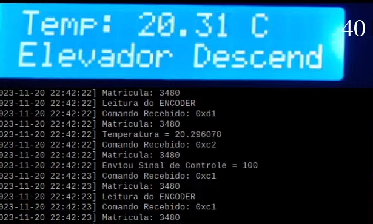

# Documentação - Matheus Soares - Trabalho 2

### Link para vídeo
[Vídeo](https://www.youtube.com/watch?v=8fs5bjt-APg)

>Desculpa pela tela do google meets, eu infelizmente não vi, só comecei a gravar e troquei pro meu notebook onde mostro tudo. Como ta impossível de gravar nas rasp pelo congestionamento, vou deixar desta maneira.

## 1. Como rodar
<div style="text-align: justify">Clone o repositório no ambiente da Raspberry Pi;
</div>
<br>

**PS: O trabalho em questão faz uso da BME280, ao rodar por favor utilize a `rasp 40`.**

<br>

```bash
cd trabalho-2-2023-2-MtsSrs
make
```

Feito isso basta executar o binário:

```bash
./bin/bin
```

## 2. Alguns pontos importantes. Atenção!!
<div style="text-align: justify"> O meu projeto depende da calibragem e ela por sua vez é demorada. Caso tenha algum problema, pelo fato de pegar o sinal do sensor ser algo que depende de alguns fatores a calibragem pode acabar falhando e por sua vez será necessário executar a calibragem mais de uma vez. Como o início das minhas threads dependem de uma calibragem feita, caso não tenha sucesso dê `ctrl+c` e execute o programa de novo.</div>

### 2.1 Calibragem
<div style="text-align: justify"> Para que a calibragem funcione perfeitamente, garante que o elevador encontre-se no encoder 0, ou seja, antes de calibrar reinicie o DashBoard </div>

### 2.2 Mock de calibragem
<div style="text-align: justify"> Como a calibragem não é um fator avaliativo do projeto e meu trabalho só pode ser executado na rasp 40, fiz uma maneira para agilizar o processo de avaliação daqueles que rodarão o meu projeto. Para isso basta passar os andares, que eu já retirei da placa, e desligar umas variáveis de controle. Mostro a seguir: </div>
<br>

No arquivo `gpio.c` set a variável de controle "calibrated = 1", na linha 25 do arquivo;
```c
int calibrated = 1; 
```
No mesmo arquivo coloque o mock de dado das alturas, como o uso será da `rasp40` temos as seguintes alturas. Modifique as linhas 11 ~ 14;
```c
int groundHeight = 2190;
int floorOneHeight = 6443;
int floorTwoHeight = 12326;
int floorThrHeight = 21733;
```


No arquivo `main.c` set a variável de controle "control = 1", na linha 19 do arquivo.
```c
int control = 1; 
```

***PS: ESSA É UMA FORMA DE PULAR A CALIBRAGEM POR SER UM PROCESSO MODERADAMENTE DEMORADO, CASO HAJA MUDANÇAS NO ENCODER DA RASP 40 OU QUEIRA FAZER TESTE DE CALIBRAGEM NÃO FAÇA ESSAS MUDANÇAS!***


## 3. Experimento

Aqui faço uma experimentação básica mas vou mostrar o caso especial;
<br>

1. Calibragem
<br>


<br>
O processo mais lento, chave do meu código, ele está com um PWM de 3, fazendo com que ocorra menos chances de perda de valor.
<br>

2. Elevador Funcionando
<br>


<br>

Aqui nesse momento a dash está toda responsiva, tanto a temperatura é alterada a cada 1 segundo, quando dá pra ver a dinâmica do PWM. O elevador sobe de forma suave, sem guinadas.
<br>

3. Display
<br>



<br>
Aqui mostra que a lógica do display, ele é atualizado a cada 1 segundo. O motivo pro estado do elevador ser "descendo" é por que o print foi tirado no momento que o elevador está fazendo mini correções em seu direcionamento, logo o display varia nesse momento entre "subindo" e "descendo".

<br>
5. O problema que pode ocorrer
<br>


<br>
Pelo meu pouco conhecimento com o uso das constantes do PID isso acabou se tornando algo comum, o elevador demora muito para chegar dentro de um range pre-estabelecido, o PWM fica sofrendo pequenas alterações e não ganha do atrito do motor. Infelizmente não fui capaz de corrigir este bug.

## 4. Instruções de comandos 
A minha main é baseada nesses comandos que o usuário pode entrar usando seus respectivos números: <br>
        1 - Request Encoder Value <br>
        2 - Send PWM control signal <br>
        3 - Send room temperature <br>
        4 - Read the registers <br>
        5 - Write in the registers <br>
        6 - Exit <br>
        7 - Elevator control <br>
        8 - Calibrate <br>
        9 - Floor command <br>
#### 1 - Request Encoder Value <br>
Comando que apenas faz um request no encoder, o seu resultado só será visto em Live. Basta chamar com o número "1";
#### 2 - Send PWM control signal <br>
Envia um PWM de 50 para dash, é apenas um teste fixo para ver se a dash recebe. Basta chamar com o número "2";
#### 3 - Send room temperature <br>
Recupera a temperatura via I2C pelo BME280 e envia para dash. Basta chamar com o número "3";
#### 4 - Read the registers <br>
Leitura do registrador, basta passar o endereço do registrador desejado em Hexadecimal no formato (OxOO ~ Ox0A) e a quantidade de bytes em Hexadecimal (0x01 ~ 0x0B), o retorno é dado em live. 
#### 5 - Write in the registers <br>
Escrita do registrador, basta passar o endereço do registrador desejado em Hexadecimal no formato (0x00 ~ 0x0A) e a quantidade de bytes em Hexadecimal (0x01 ~ 0x0B) e qual valor escrever (0x00 ou 0x01), o retorno é dado em live.
#### 6 - Exit <br>
Apenas termina o projeto
#### 7 - Elevator control <br>
Controle do elevador:<br>1 - Para subir<br>2 - Para descer<br>0 - Para parar<br>Logo em seguida coloque o PWM: Range (0 - 100)
#### 8 - Calibrate <br>
Botão mais importante, veja se o elevador está parado no encoder zero e chame a função de calibrar;
#### 9 - Floor command <br>
Passe um inteiro para qualquer valor de encoder aceitável no projeto (0 - 25500) o elevador irá até lá.
## 5. Alguns comentários
- Como o sensor pode ser pego na borda de baixo e no meu código eu dou uma faixa de 5 und. tanto para cima quanto para baixo, existe o caso infeliz onde o encoder está na posição, exemplo andar 1 = 5000 ~ 5050, se o encoder captar o número exato de 5000 o meu elevador possui uma chance de parar no 4995. Isso foi uma abordagem de minimizar o problema que eu nomeei de "orbita" onde o PID passava um PWM que não ganha do atrito inicial do motor e ficava parado ou subindo e descendo em torno do andar.
- A qualidade tá boa, o código ta modularizado mesmo com menor granularidade na parte das GPIO.C.
- O consumo de CPU está baixo, na casa dos 0.7% até 1.4%.
- Pelo fato de eu não saber mexer muito com as constantes do PID acontecem casos que o PWM não está dimensionado para atender ao objetivo do andar, ocorrendo a famosa "orbita" em torno do andar onde o elevador fica muito próximo do objetivo mas não freia.

## 6. O que foi feito 
|   ITEM    |   DETALHE  |   Feito  |
|-----------|------------|:---------:|
Controlador PID |Correta implementação do controlador PID (motor PWM), incluindo a leitura do encoder e acionamento da direção dos motores, correto posicionamento dos elevadores nos andares (ao parar no andar, o sinal do sensor do andar deve acender).| :heavy_check_mark: |
|Menu de controle|Correta leitura e acionamento de eventos baseados nos comandos dos usuários por meio dos botões no dashboard.|:heavy_check_mark:|
|Leitura da Temperatura Ambiente|Leitura dos valores de Temperatura Ambiente (Sensor BMP280).|:heavy_check_mark:|
|Comunicação UART|Leitura do encoder, botões e envio de temperatura e do sinal de controle através da comunicação MODBUS-UART.|:heavy_check_mark:|
|Mostrador no LCD|Apresentação do funcionamento do elecador menu no LCD incluindo o estado atual e a temperatura ambiente.|:heavy_check_mark:|
|Qualidade do Código|Utilização de boas práticas como o uso de bons nomes, modularização e organização em geral.|:heavy_check_mark:|
|README com Experimento|Documentação README com instruçoes de compilação, de uso e relatório do experimento com o gráfico e vídeo.|:heavy_check_mark:|
|Pontuação Extra|Qualidade e usabilidade acima da média.|:heavy_check_mark:|

[](https://classroom.github.com/a/3JMEv0-8)
